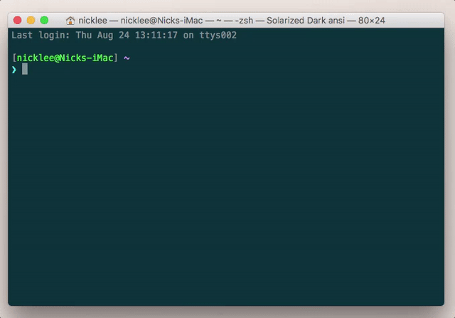
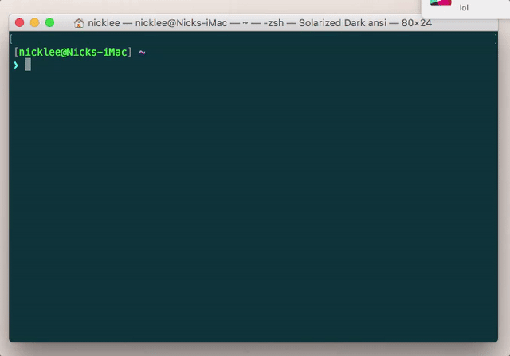
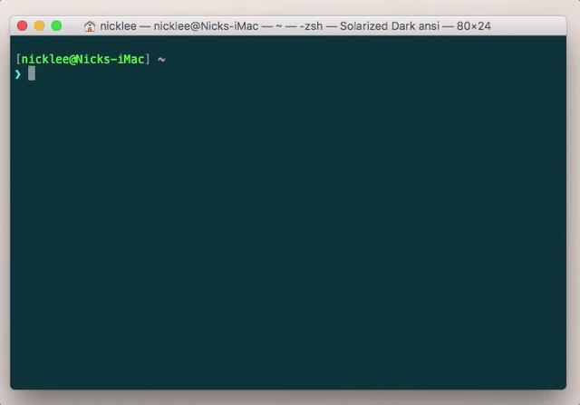

# EzPaaS CLI
### A miniature Heroku clone for easy in-house deployments, powered by Docker.

## What Is It?

At [Tendigi](http://www.tendigi.com), we build applications for a variety of clients, often simultaneously, and those applications usually require  server-side infrastructure. We also build [random things internally](https://blog.tendigi.com/people-who-are-really-serious-about-software-should-make-their-own-hardware-6983007e7427) from time to time, and these often depend on services that have to live *somewhere*.

For production deployments, we love [Heroku](https://heroku.com) (when it makes financial sense) as well as systems like [Deis](https://deis.com/) which can be deployed on AWS / DigitalOcean / etc.

We longed for a simple, on-site [PaaS](https://en.wikipedia.org/wiki/Platform_as_a_service) solution that we could hack on as our needs evolved. [Dokku](https://github.com/dokku/dokku) is a great project, but we ran into some issues with it (problems updating to newer versions, discrepancies in application behavior compared to our other Deis deployments, a little annoying to work on because it's a collection of shell scripts, etc). As a result, we built EzPaaS: a mini Heroku clone, built in Ruby, powered by Deis images running on Docker.

## Prerequsites

#### EzPaaS Server

To use this CLI utility, you need to have EzPaaS Server deployed somewhere. This can be on your local machine (the CLI will connect to `localhost` on port 3000 by default) or a remote server by passing the `--server` option.

## Installation

Install the gem. The easiest way is to install it for all users with `sudo`:

`$ sudo gem install ezpaas-cli`

## Usage

### Create an app

`$ ezpaas apps create`

### List all apps on the server

`$ ezpaas apps list`

### Deploy an app

`$ ezpaas deployments push --app=<app name>`

### Scale an app

`$ ezpaas deployments scale [<process=count>...] --app=<app name>`

### Take an app down

`$ ezpaas deployments destroy --app=<app name>`

### Delete an app

`$ ezpaas apps destroy`

## Contributing

Bug reports and pull requests are welcome on [GitHub]().

## License

The gem is available as open source under the terms of the [MIT License](http://opensource.org/licenses/MIT).
